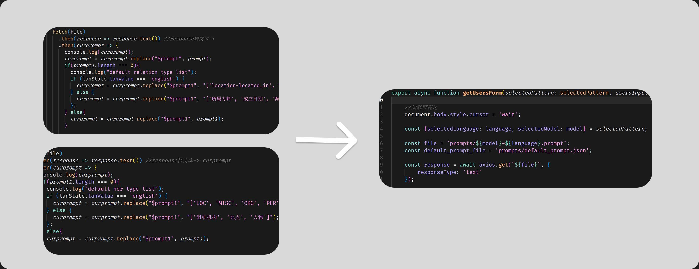
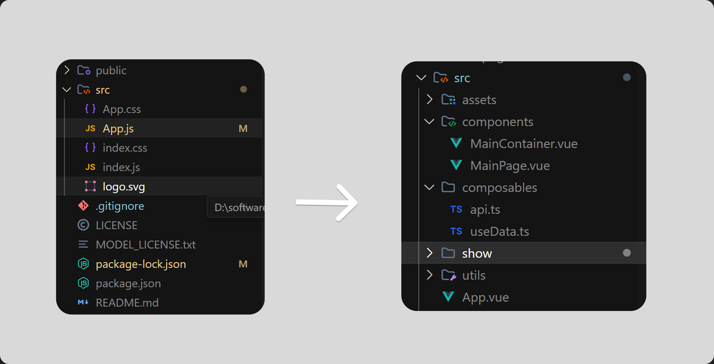
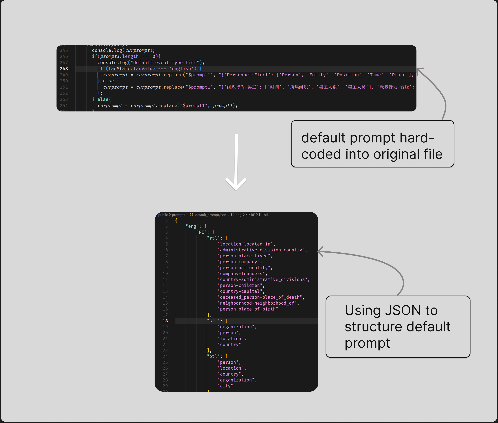

# GPT4IE

**NOTE: It's a rebuilt version of [GPT4IE](https://github.com/cocacola-lab/GPT4IE) from [cocacola-lab](https://github.com/cocacola-lab) BJTU.**

This project updated some **engineering improvements** of original project and **simplified code**, making it a pure and understandable version.

This version of GPT4IE is also a double-language IE extraction tool, powered by [DouBao](https://www.volcengine.com/) API.

## What I have done

Original project has a lot of **repetitive function**, making it bloated and not elegant enough. I simplified the core code and combined them into one function:

Orginal version made **all the code coupled** into one file, making the project structure difficult to understand. I made the code clearer by layering the structure:

Orginal version **hard-coded default prompt** in the code, I extractd them into `/prompts/default_prompt.json`, making it more pure and clean:

## Tests

NOTE: tested IE result is based on `doubao-lite-32k-240828`, the complate test suite is located at `/test`.

### RE

#### Ch

Example:
sentence: 北京大学创办于 1898 年，初名京师大学堂，是中国近代第一所国立综合性大学，现任校长是龚旗煌。
rtl: [' 所属专辑 ', ' 成立日期 ', ' 海拔 ', ' 官方语言 ', ' 占地面积 ', ' 父亲 ', ' 歌手 ', ' 制片人 ', ' 导演 ', ' 首都 ', ' 主演 ', ' 董事长 ', ' 祖籍 ', ' 妻子 ', ' 母亲 ', ' 气候 ', ' 面积 ', ' 主角 ', ' 邮政编码 ', ' 简称 ', ' 出品公司 ', ' 注册资本 ', ' 编剧 ', ' 创始人 ', ' 毕业院校 ', ' 国籍 ', ' 专业代码 ', ' 朝代 ', ' 作者 ', ' 作词 ', ' 所在城市 ', ' 嘉宾 ', ' 总部地点 ', ' 人口数量 ', ' 代言人 ', ' 改编自 ', ' 校长 ', ' 丈夫 ', ' 主持人 ', ' 主题曲 ', ' 修业年限 ', ' 作曲 ', ' 号 ', ' 上映时间 ', ' 票房 ', ' 饰演 ', ' 配音 ', ' 获奖 ']
stl: [' 国家 ', ' 行政区 ', ' 文学作品 ', ' 人物 ', ' 影视作品 ', ' 学校 ', ' 图书作品 ', ' 地点 ', ' 历史人物 ', ' 景点 ', ' 歌曲 ', ' 学科专业 ', ' 企业 ', ' 电视综艺 ', ' 机构 ', ' 企业 / 品牌 ', ' 娱乐人物 ']
otl: [' 国家 ', ' 人物 ', ' 地点 ', ' 气候 ', ' 城市 ', ' 歌曲 ', ' 企业 ', ' 音乐专辑 ', ' 学校 ', ' 作品 ', ' 语言 ']

#### En

Example:
sentence: "Apple Inc., founded by Steve Jobs, Steve Wozniak, and Ronald Wayne in 1976, is headquartered in Cupertino, California. Its CEO is Tim Cook."
rtl: ['founder', 'headquarters', 'CEO', 'founding year', 'industry', 'product', 'revenue', 'employees', 'market value', 'parent company']
stl: ['corporation', 'technology company', 'entrepreneur', 'executive', 'city', 'state']
otl: ['organization', 'person', 'location', 'year', 'job title']

### NER

#### Ch

Example: 
sentence: 雷军是小米科技的创始人，该公司总部设在湖北武汉。
etl: [' 人物 ', ' 企业 ', ' 地点 ', ' 省份 ', ' 城市 ']

#### En

Example:
sentence: Elon Musk founded SpaceX, which is based in Hawthorne, California.
etl: ['PER', 'ORG', 'LOC', 'STATE']

### EE

#### Ch

Example:
sentence: 委员会于 2023 年在广州选举赵红为主席。
etl: {' 人事：选举 ': [' 人物 ', ' 实体 ', ' 职位 ', ' 时间 ', ' 地点 '], ' 商业：宣布破产 ': [' 机构 ', ' 时间 ', ' 地点 '], ' 司法：逮捕入狱 ': [' 人物 ', ' 执行者 ', ' 罪行 ', ' 时间 ', ' 地点 '], ' 生活：离婚 ': [' 人物 ', ' 时间 ', ' 地点 '], ' 生活：伤害 ': [' 施害者 ', ' 受害者 ', ' 工具 ', ' 时间 ', ' 地点 ']}

#### En

Example:
sentence: Last month, the company declared bankruptcy in New York.
etl: {'Personnel:Elect': ['Person', 'Entity', 'Position', 'Time', 'Place'], 'Business:Declare-Bankruptcy': ['Org', 'Time', 'Place'], 'Justice:Arrest-Jail': ['Person', 'Agent', 'Crime', 'Time', 'Place'], 'Life:Divorce': ['Person', 'Time', 'Place'], 'Life:Injure': ['Agent', 'Victim', 'Instrument', 'Time', 'Place']}

## Deploy

NOTE: It's a Vue project so make sure you have installed nodejs on your device.

+ run `npm install` 

+ register a [DouBao API account](https://www.volcengine.com/) and get your API key

+ run `npm run dev` to start

